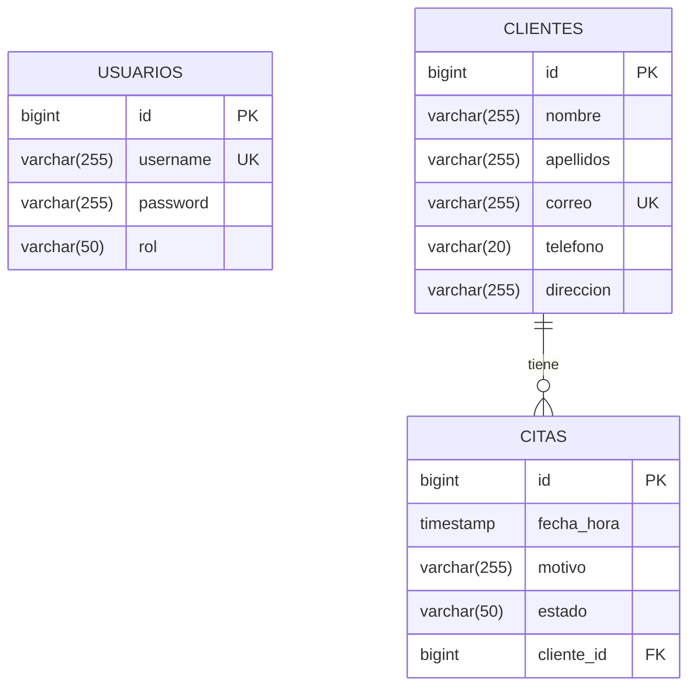
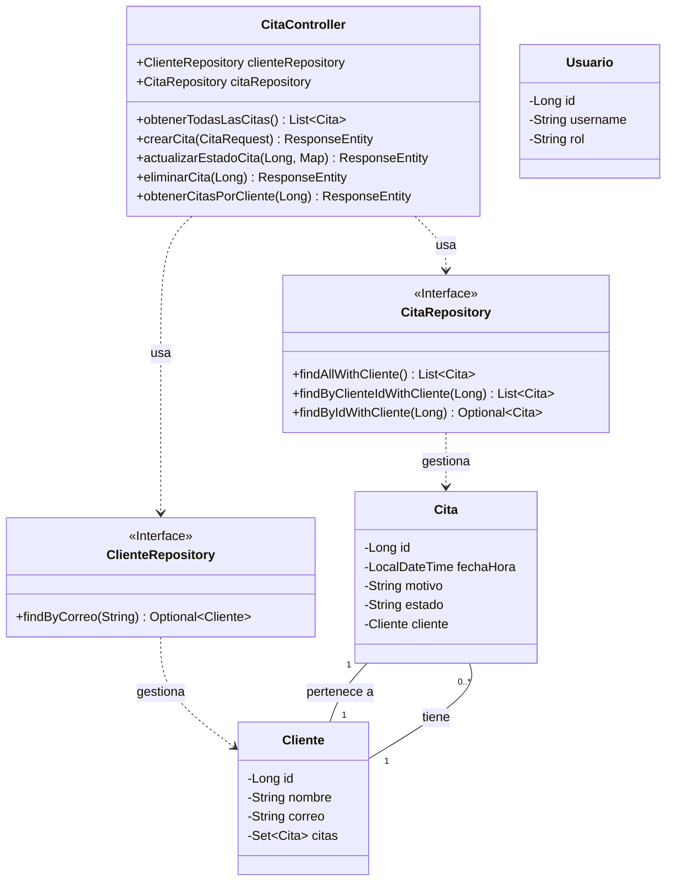
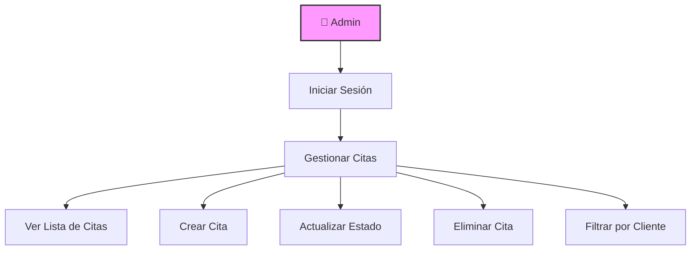
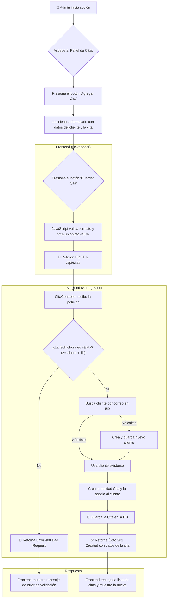
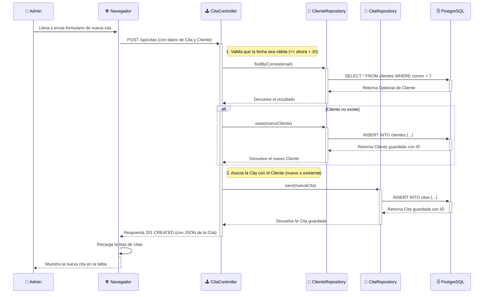
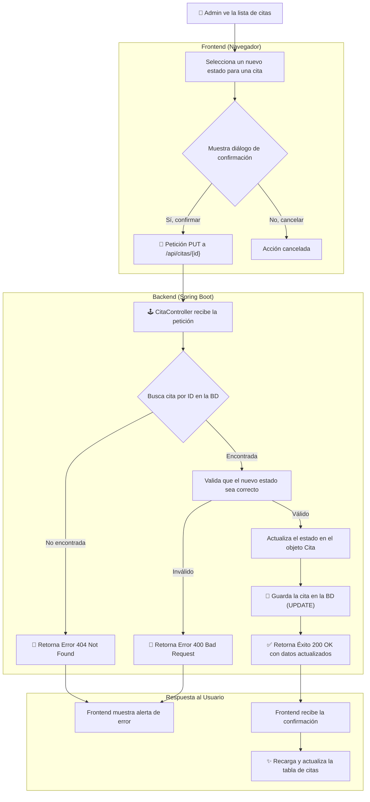
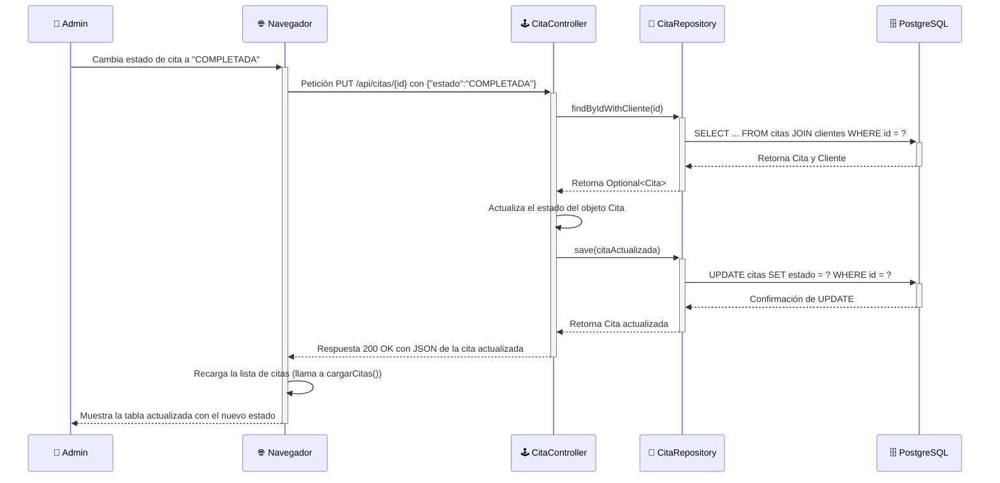
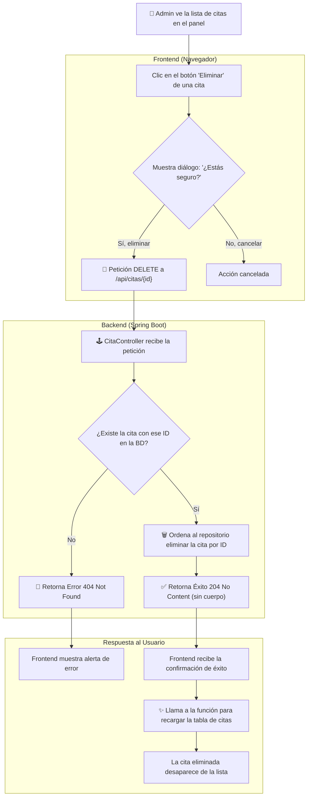
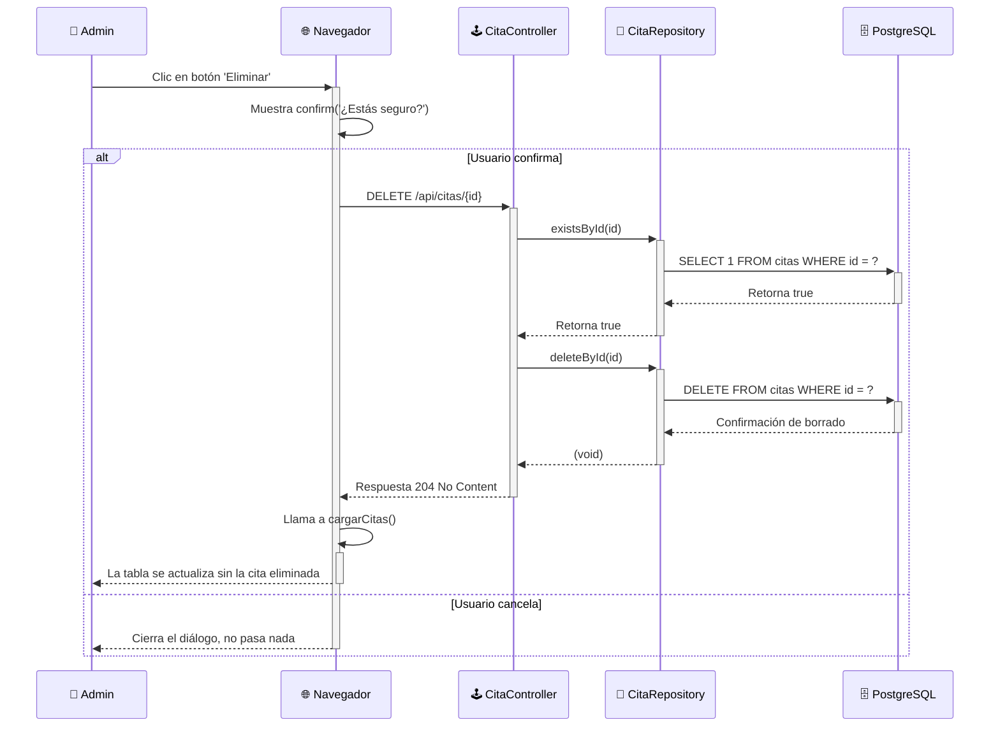

# Documentación técnica — Citas Service

> Contenido: diagramas (ER, flujo, clases, casos de uso, secuencia, UML), descripción de funcionamiento, reglas de negocio, retroalimentación, trabajo a futuro y conclusión.

---

## 1. Resumen

Aplicación backend REST (Java y Spring Boot) para gestión de **citas** con autenticación basada en Spring Security y persistencia en PostgreSQL.

---
## 2. Descripción de Funcionamiento y Reglas de Negocio

### Funcionamiento General Frontend
El sistema opera como una aplicación web de página única (SPA) para el administrador. Tras una autenticación exitosa, el administrador accede a un panel donde puede visualizar, crear, modificar y eliminar citas. La interfaz es dinámica, se comunica con el backend a través de una API REST y se actualiza en tiempo real sin necesidad de recargar la página. La orquestación mediante Docker Compose permite levantar todo el entorno (backend y base de datos) con un único comando.

### Reglas de Negocio
* Acceso Restringido: Solo los usuarios autenticados con el rol ADMIN pueden acceder a las funcionalidades de gestión de citas.

* Unicidad de Clientes: Un cliente se considera único por su dirección de correo electrónico. Si se intenta crear una cita para un correo ya existente, el sistema reutiliza el cliente en lugar de crear un duplicado.

* Estado por Defecto: Toda nueva cita se crea con el estado PENDIENTE.

* Validación de Fechas Pasadas: El sistema no permite agendar citas en una fecha u hora anterior al momento actual.

* Validación de Antelación Mínima: Es obligatorio agendar las citas con al menos una hora de antelación respecto a la hora actual del servidor.

---
## 3. Modelo de datos (Descripción y ER)

### 3.1 Tablas principales (resumen)

El modelo de datos es el núcleo del sistema y está diseñado para ser simple pero robusto. Se compone de tres entidades principales: Usuarios, Clientes y Citas, gestionadas en una base de datos relacional PostgreSQL.

Usuarios: Representa a los operadores del sistema (actualmente solo el rol de ADMIN). Es responsable de la autenticación y autorización.

Clientes: Almacena la información de las personas que solicitan las citas. El correo es un campo único para identificar y evitar clientes duplicados.

Citas: Contiene la información de la cita en sí, incluyendo fecha, hora, motivo y estado. Cada cita está obligatoriamente asociada a un único cliente.

La relación clave es entre Clientes y Citas, donde un cliente puede tener múltiples citas (uno a muchos).

### 3.2 Reglas de integridad importantes

* `clientes.correo` es único.
* `citas.cliente_id` no puede ser NULL (relación ManyToOne obligatoria).
* `usuarios.username` único.

### 3.3 Diagrama Entidad-Relación (Mermaid)

---

## 4. Diagramas de Arquitectura y Flujo (UML y otros)

### 4.1 Diagrama de Clases

Descripción: Muestra la estructura estática de las clases principales del backend, sus atributos, métodos clave y las relaciones entre ellas. Se centra en las capas de Controlador, Repositorio y Modelo (Entidades).

### 4.2 Diagrama de Casos de Uso

Descripción: Define las interacciones entre el actor (el Administrador) y el sistema, mostrando las funcionalidades clave desde la perspectiva del usuario.

### 4.3 Diagrama de Flujo: Creación de una Cita

Descripción: Este diagrama ilustra el flujo completo de eventos, desde la interacción del administrador en el frontend hasta el almacenamiento de los datos en la base de datos, incluyendo la lógica de validación.

### 4.4 Diagrama de Secuencia: Creación de una Nueva Cita

Descripción: Este diagrama muestra la interacción cronológica entre los diferentes componentes del sistema cuando un administrador crea una nueva cita. Detalla cada paso, desde el envío del formulario en el frontend hasta las consultas y escrituras en la base de datos, incluyendo la lógica condicional para manejar clientes nuevos o existentes.

### 4.5 Diagrama de Flujo: Actualización de Estado de una Cita

Descripción:Este diagrama de flujo detalla el proceso que se desencadena cuando el administrador cambia el estado de una cita en el panel (por ejemplo, de "PENDIENTE" a "COMPLETADA"). Muestra las validaciones, la interacción con la base de datos y la actualización final de la interfaz de usuario.

### 4.6 Diagrama de Secuencia: Actualizar Estado de una Cita

Descripción: Modela la interacción paso a paso y en orden cronológico entre los componentes del sistema para un caso de uso específico: cuando el administrador cambia el estado de una cita desde la interfaz.

### 4.5 Diagrama de Flujo: Eliminar una Cita

Descripción:Este diagrama ilustra el proceso completo que sigue el sistema cuando un administrador decide eliminar una cita. Muestra los pasos de confirmación en el frontend, las validaciones en el backend, la operación en la base de datos y la actualización final de la vista para el usuario.

### 4.6 Diagrama de Secuencia: Eliminar una Cita

Descripción: Este diagrama modela la interacción cronológica y los mensajes pasados entre los componentes del sistema durante el proceso de eliminación. Es especialmente útil para ver las llamadas exactas entre el controlador, el repositorio y la base de datos.

---

## 5. Trabajo Futuro y Mejoras Propuestas

El estado actual del proyecto es un excelente Producto Mínimo Viable (MVP). Para llevarlo a un entorno de producción, se proponen las siguientes mejoras:

1. Gestión de Roles Avanzada: Introducir un rol CLIENTE que permita a los usuarios registrarse, iniciar sesión y ver/cancelar sus propias citas.

2. Sistema de Notificaciones: Implementar un servicio (posiblemente un nuevo microservicio) para enviar correos electrónicos de confirmación, recordatorio y cancelación de citas.

3. Seguridad Mejorada: Migrar de la autenticación basada en sesión a un esquema basado en tokens (JWT), que es más adecuado para arquitecturas de microservicios y clientes móviles. Al igual de la propuesta del sistema de notificaciones, se crearía en otro microservicio para unificar la gestion de roles en el cual se menciona en el punto uno y se unificaría con la creación de token para el manejo de la sesión

4. Pruebas Automatizadas: Desarrollar una suite de pruebas unitarias (con JUnit/Mockito) e de integración (con Testcontainers) para garantizar la fiabilidad del código y evitar regresiones.

5. Calendario Visual: En el frontend, reemplazar la tabla por una vista de calendario interactiva para una mejor experiencia de usuario al agendar.

6. Pipeline de CI/CD: Configurar un pipeline de Integración y Despliegue Continuo (ej. con GitHub Actions, Jenkins) para automatizar las pruebas y el despliegue de nuevas versiones.

---

## 6. Retroalimentación

El proyecto actual presenta una base sólida y sigue buenas prácticas en cuanto a tecnología y contenedorización.

### Puntos Fuertes:

* Stack Tecnológico Moderno: El uso de Spring Boot 6, Java 21 y Docker posiciona al proyecto a la vanguardia.

* Arquitectura Desacoplada: La separación clara entre frontend, backend y base de datos permite un desarrollo y escalado independientes.

* Entorno Portable: Docker Compose garantiza que cualquier desarrollador pueda levantar el sistema de forma idéntica y sin configuraciones complejas.

### Áreas de Mejora Arquitectónica:

1. Capa de Servicio (@Service): Actualmente, la lógica de negocio reside en el Controlador (@RestController). Se recomienda refactorizar esta lógica a una capa de Servicio (@Service) para mejorar la separación de responsabilidades y hacer el código más mantenible y testeable.

2. Uso de DTOs (Data Transfer Objects): La API expone directamente las entidades JPA. Esto acopla la API al modelo de datos y puede exponer información sensible. La implementación de DTOs para las respuestas y peticiones de la API es una mejora crucial.

3. Gestión de Errores Centralizada: Se debería implementar un manejador de excepciones global con @ControllerAdvice para estandarizar las respuestas de error en toda la aplicación.

---

## 7. Conclusión

El Sistema de Gestión de Citas es un prototipo funcional robusto que cumple con todos los requisitos iniciales. La arquitectura elegida es escalable y se alinea con los estándares modernos de desarrollo de software.

Implementando las mejoras sugeridas en las secciones de "Trabajo Futuro" y "Retroalimentación", el proyecto tiene un camino claro para evolucionar hacia una aplicación de nivel de producción, segura, fiable y fácil de mantener.